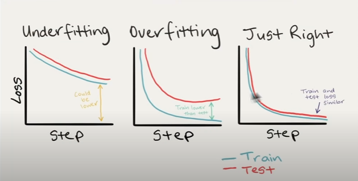

Pytorch domain libraries
a. TrochVison (image based)
b. TrochText (Text Based)
c. TrochAudio (Audio Based)
D. TrochRec (making a recommendation)

setiap domain libraries pytorch memiliki datasetnya sendiri untuk dijadikan bahan latihan,contohnya pada torchVision terdapat FashionMNIST

Standard image classification data format:
data/
    photo/ <- overall dataset folder
        train/ <- train data
            class_name1/ <- class name as folder name
                image01.jpeg
                image02.jpeg
                ...
            class_name2/
                images03.jpeg
                image04.jpeg
                ...
            .../
                ...
                ...
        test/ <- test data
            class_name1/
                image05.jpeg
                image06.jpeg
                ...
            class_name2/
                image07.jpeg
                image08.jpeg
                ...
            .../
                ...
                ...

hal hal yang akan memperbaiki model:
1. add more layers/blocks
2. add more neurons / hidden units
3. add more epoch
4. change the activation function (ReLU,tanh,etc)
5. change learning rate
6. change the loss function

Ideal curves:

- underfitting: loss tidak mencapai minimum point atau acc tidak mencapai maximum point
- overfitting: model terlalu bagus pada train saja

how to reduce underfitting
1. Add more layer/neruons(units) to your model
2. Tweak the learning rate / menurunkan learning rate
3. Train for longer
4. Use transfer learning / mengambil weight pada model lain dan meniru pattern nya untuk model yang sedang di kembangakan
5. Use less regularization / terlalu banyak melakukan pengurangan pada overfitting akan berakhir dengan underfitting

how to reduce overfitting
1. Get more data
2. Data augemntation
3. Better data
4. Use transfer learning
5. Simplify model / mengurangin kompleksitas yang tidak perlu
6. Use learning rate decay / learning rate schedule
7. Use really stopping / menghentikan saat model mencapai mininum ketika train step masih tersisa

acuan:
- pytorch transforming and augmenting images
- pytorch state-of-art
- torchVison transform
- testing and debugging in machine learning

